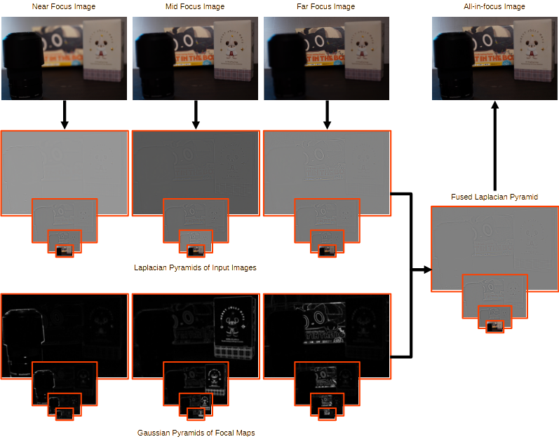

# Multi-focus Image Fusion

## 0. Depth of Field Fusion

Depth of field (DOF) fusion is a process that combines multiple partially focused images into a single all-in-focus image.

**Input images**

<table>
  <tr>
    <td width="33%">Near focus</td>
    <td width="33%">Mid focus</td>
    <td width="33%">Far focus</td>
  <tr>
    <td width="33%"></td>
    <td width="33%"></td>
    <td width="33%"></td>
</table>

**Fusion result**

### 0.1. Depth of Field and Blur

- **Depth of Field (DOF)** is the range of distances in a scene that appear acceptably sharp in an image  
- DOF is mainly determined by the lens aperture (f-number)  
- A shallower DOF leads to stronger blur outside the focus plane  

## 0.2. Focus Breathing

- Even with a prime lens, shifting the focus plane slightly changes the effective focal length and field of view (**focus breathing**)  
- Focusing closer tends to narrow the field of view, while focusing farther tends to widen it  

## 1. Fusion Pipeline

1. Image alignment  
2. Focus map computation  
3. Image fusion  
   1. Weighted average fusion  
   2. Pyramid fusion  

### 1.1. Image Alignment

- Focus breathing causes slight field-of-view changes across images  
- To compensate, an **affine transformation** (scaling, rotation, translation, shear) is estimated and applied  
- The near-focus image (narrowest FOV) is used as the reference, and the other images are aligned to it  

**Alignment result**

- Top: before alignment, Bottom: after alignment  

<table>
  <tr>
    <td width="33%">Near focus</td>
    <td width="33%">Mid focus</td>
    <td width="33%">Far focus</td>
  <tr>
    <td width="33%"></td>
    <td width="33%"></td>
    <td width="33%"></td>
</table>

### 1.2. Focus Map Computation

- Apply a Laplacian filter to each image to evaluate edge strength (degree of sharpness)  
- Apply a Gaussian filter to spread the response and generate a smooth focus map  

<table>
  <tr>
    <td width="33%">Near focus</td>
    <td width="33%">Mid focus</td>
    <td width="33%">Far focus</td>
  <tr>
    <td width="33%"></td>
    <td width="33%"></td>
    <td width="33%"></td>
</table>

### 1.3. Image Fusion

#### 1.3.1. Weighted Average Fusion (Single-Scale)

- Use focus maps as weights for each input image  
- Compute a weighted average per pixel to obtain an all-in-focus image  

#### 1.3.2. Pyramid Fusion (Multi-Scale)

- Decompose each input image into a Laplacian pyramid  
- Decompose the focus maps into Gaussian pyramids  
- Perform weighted averaging at each scale to build a fused Laplacian pyramid  
- Reconstruct the fused pyramid into the final all-in-focus image  

**Fusion results**

- Weighted average fusion may introduce artifacts (e.g., double edges or ghosting around sharp transitions)  
- Pyramid fusion leverages multi-scale information: global structures are fused at coarse levels, while fine details are fused at higher resolutions, reducing artifacts and producing a more natural result  

<table>
  <tr>
    <td width="33%">Weighted average fusion</td>
    <td width="33%">Pyramid fusion</td>
  <tr>
    <td width="50%"></td>
    <td width="50%"></td>
</table>
