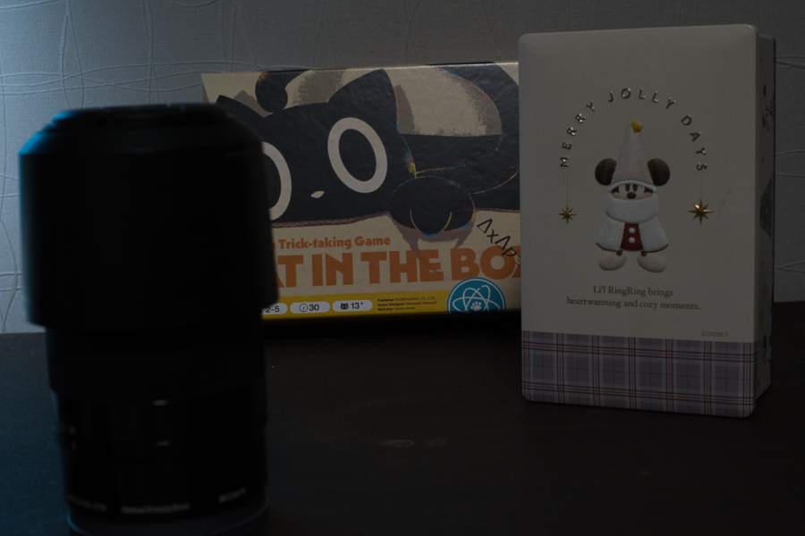
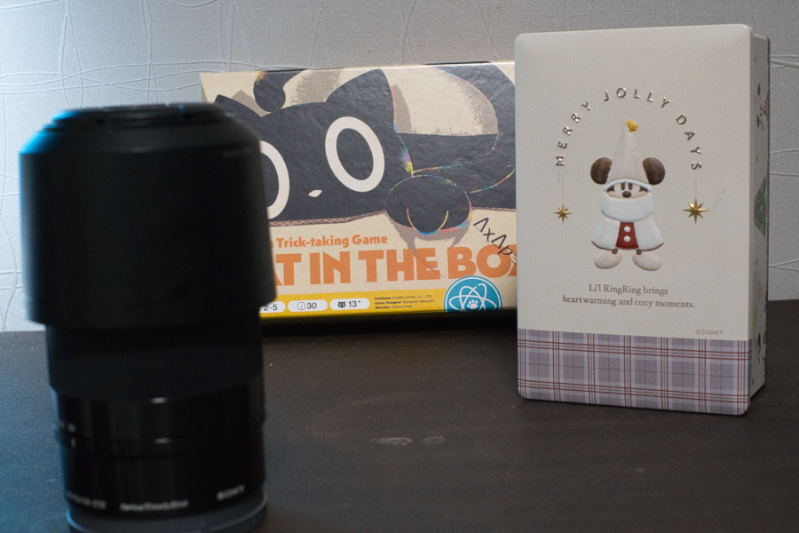
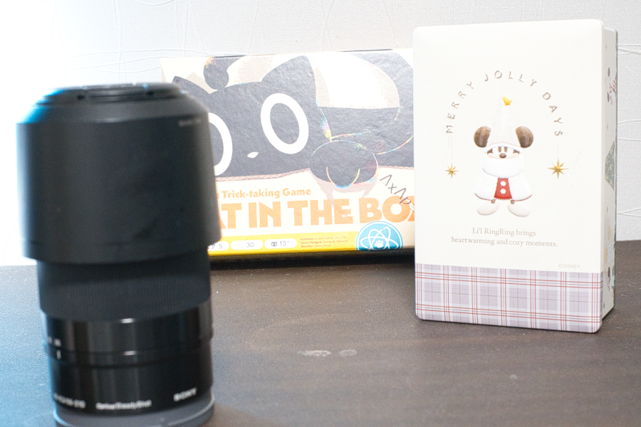
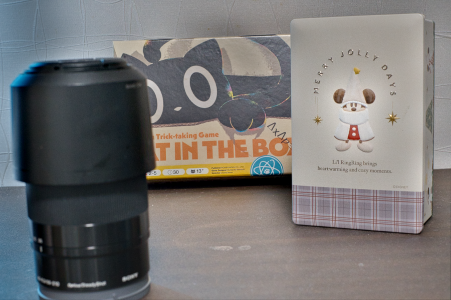

# HDR Image Fusion

**Input images**

<table>
  <tr>
    <td width="33%">EV -2.0</td>
    <td width="33%">EV 0.0</td>
    <td width="33%">EV +2.0</td>
  <tr>
    <td width="33%"></td>
    <td width="33%"></td>
    <td width="33%"></td>
</table>

**Fusion result**

More detail will be added...