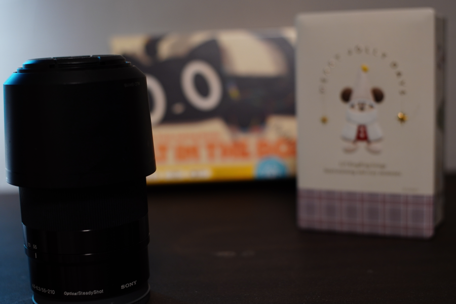

# 被写界深度合成

<table>
  <tr>
    <td width="24%">Input (Near)</td>
    <td width="24%">Input (Mid)</td>
    <td width="24%">Input (Far)</td>
    <td width="24%">Output (All in Focus)</td>
  </tr>
  <tr>
    <td width="24%"></td>
    <td width="24%"></td>
    <td width="24%"></td>
    <td width="24%"></td>
  </tr>
</table>

## 1. 画像アラインメント

- 焦点位置を変化させると、（単焦点レンズであっても）画角が微小変動する（**フォーカスブリージング**）
  - 近距離フォーカスの場合は画角が狭くなる
  - 遠距離フォーカスの場合は画角が広くなる
- 画像間のアフィン変換（拡大縮小・回転・並進・せん断）を推定することで、基準画像にアラインメントする

<table>
  <tr>
    <td width="33%">Input (Near)</td>
    <td width="33%">Input (Mid)</td>
    <td width="33%">Input (Far)</td>
  </tr>
  <tr>
    <td width="33%"></td>
    <td width="33%"></td>
    <td width="33%"></td>
  </tr>
  <tr>
    <td width="33%">Aligned (Near)</td>
    <td width="33%">Aligned (Mid)</td>
    <td width="33%">Aligned (Far)</td>
  </tr>
  <tr>
    <td width="33%"></td>
    <td width="33%"></td>
    <td width="33%"></td>
  </tr>
</table>

## 2. 焦点マップ計算

- 各画像に対してラプラシアンフィルタを適用し、エッジの強さ（合焦度）を評価
- ガウシアンフィルタによってエッジを広げ、焦点マップを生成

## 3. 被写界深度合成

### 3.1 加算平均合成

- 焦点マップを用いて画像を重み付き合成

### 3.2 ピラミッド合成

- ガウシアンピラミッドを構築
  - ガウシアンフィルタをかけてからダウンスケールすることで、画像を多段階に圧縮した画像群を生成
- ラプラシアンピラミッドを構築
  - ガウシアンピラミッドの各レベルの画像をアップスケールして1段階高解像の画像サイズに合わせる
  - アップスケールした画像を1段階高解像の画像から差し引き、その差分画像をラプラシアン画像とする
  - ただし最も低い解像度のラプラシアン画像は同一解像度のガウシアンピラミッド画像とする

